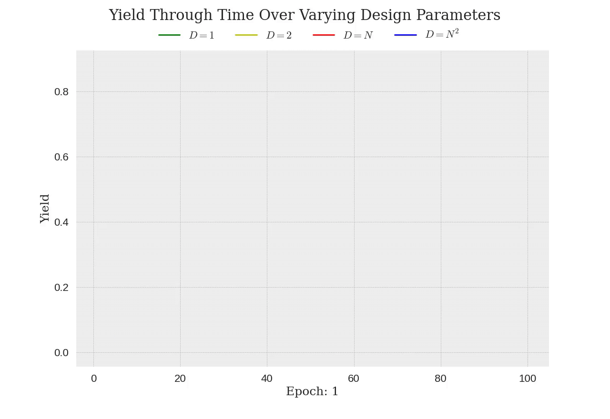

# Highly Optimized Tolerance Simulation Exploration

An implementation and exploration of J.M. Carlson and J. Doyle's "[Robustness and design in complex systems](https://authors.library.caltech.edu/1523/)," motivated by University of Vermont Professor [Peter Dodds](http://www.uvm.edu/pdodds/pocs/episodes/13f/). 

---

This paper studies how the introduction of even small engineering processes can create vast differences in the behavior of complex systems, and the consequences that follow. For a more in depth look, check out the corresponding post on my [website](https://www.zonay.net/). 

